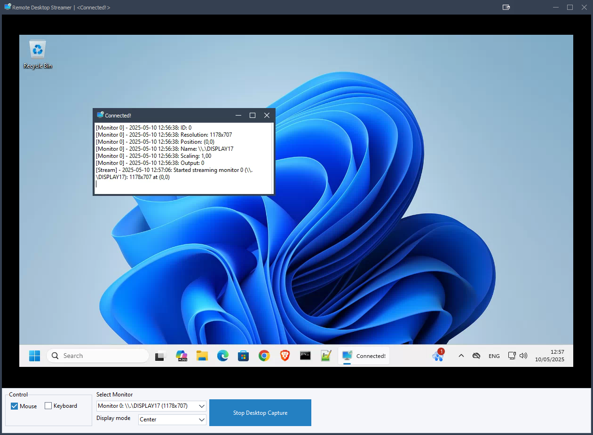

# Remote Desktop Streamer-Delphi

A lightweight remote desktop streaming and control solution built entirely in Delphi.

  

## Overview

Delphi Remote Desktop Streamer provides real-time remote desktop viewing and control capabilities over a network connection. The application consists of two components:

1. **Server Application** - Runs on the controlling computer and receives the desktop stream
2. **Client Application** - Runs on the target computer whose screen is being shared

## Features

- **Real-time screen sharing** with high performance VP8 video compression
- **Multiple monitor support** with ability to select which monitor to stream
- **Remote control functionality** including:
  - Mouse movement and clicking (left, right, and middle buttons)
  - Keyboard input with full keystroke mapping
  - Mouse wheel scrolling
- **Cursor synchronization** between client and server
- **Automatic reconnection** if the connection is lost
- **Flexible display modes**:
  - Stretch (fill the window)
  - Center (maintain original size)
  - Fit (maintain aspect ratio)
- **Hardware acceleration** options with DXGI for better performance
- **Fallback to GDI** when DXGI is not available

## Technical Details

- Built using Delphi with VCL components
- Uses libvpx for high-efficiency video compression (VP8)
- Network communication via [Netcom7](https://github.com/DelphiBuilder/NetCom7) socket (you can use my [updated version](https://github.com/spawn451/NetCom7))
- Supports both DXGI and GDI screen capture methods
- DirectX support for hardware-accelerated screen capture when available

## Installation

No installation needed - the application is portable.

### Building from Source

1. Clone the repository
2. Open the project in Delphi IDE
3. Ensure all required dependencies are installed
4. Compile both the client and server applications
5. jpeg62.dll, libvpx.dll, libyuv.dll must be in the same folder of the client or server binaries, you can find them in the LIB folder of this repo.  

## Usage

### Server (Controlling Computer)

1. Run the `RemoteDesktopServer.exe` application
2. The application will listen for incoming connections on port 3434 by default
3. Once a client connects, you will see the "Connected!" status
4. Select the client monitor you wish to view from the dropdown menu
5. Click "Start Desktop Capture" to begin streaming
6. Enable "Mouse Control" and/or "Keyboard Control" checkboxes to interact with the remote system

### Client (Target Computer)

1. Run the `RemoteDesktopClient.exe` application
2. Enter the server IP address in the configuration
3. The client will automatically attempt to connect to the server
4. When connected, the client will report all available monitors
5. The client will begin streaming when instructed by the server

## Configuration

- Default server port: 3434
- Default client connection: 192.168.10.30:3434

Edit the source code to modify these defaults before compilation.

## Known Issues (ToDo)

- Some applications running in elevated mode may not respond to remote input

## Contributing

Contributions are welcome! If you have suggestions or bug fixes, please fork the repository and submit a pull request.

Made with ❤️ using Delphi RAD Studio

